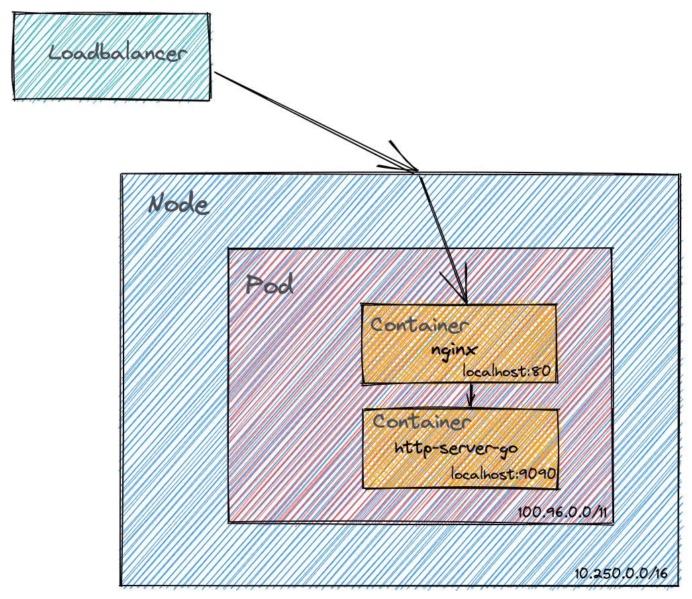

# Nginx deployment

## Task

An application running behind a reverse proxy should be able to see not only the proxy's internal IP-address that makes the http request to the web server, rather the client's real IP-address.
Your task is to create a kubernetes deployment based on nginx that prints both the client's real IP- address and the kubernetes internal IP-address, eg.
$ curl -H 'Host: aaa.fu' 192.168.39.72real: 192.168.39.1proxy: 172.17.0.3
Feel free to use any kubernetes implementation, we recommend minikube. Please share all the yaml manifests required for the solution with us.
Also run ngrep in the nginx container to check what http communication exchange happens and show us its output as well.

## Solution

### Setup environment

I have used [Gardener](https://github.com/gardener/gardener) cluster with GCP VMs.

### Deployment

Run the following command in the exercise directory:

```bash
export KUBECONFIG=/path/to/the/kubeconfig/file
./deploy.sh 
```

This script templates(heredoc) and applies the kubernetes resource files(yamls) from nginx-http-server folder

### Architecture



#### Nginx and Loadbalancer configuration

Nginx configuration can be found in the `default.conf` file. The Client IP is forwarded in the Headers to the http server.  
At the loadbalancer configuration (service.yaml) the `externalTrafficPolicy` is set to `Local` in order to preserve the source IP of traffic coming into a cluster node.

#### Http server

I made a basic http server to return the nginx proxy ip and the real ip. This can be found in the `http-server.go` file.

### Test

```bash
➜  3-nginx-deployment git:(main) ✗ curl -H 'host: aaa.fu'  34.79.196.224
real: 193.16.224.10proxy: 127.0.0.1
```

Using ngrep:

```bash
k exec -it http-server-8557dbd457-cdsq5  -c nginx /bin/sh
apk add ngrep
/ # ngrep
interface: eth0 (100.96.0.44/255.255.255.255)
filter: ((ip || ip6) || (vlan && (ip || ip6)))
####
T 193.16.224.10:60688 -> 100.96.0.44:80 [AP] #4
  GET / HTTP/1.1..Host: aaa.fu..User-Agent: curl/7.77.0..Accept: */*....                                                                                                                                                                   
##
T 100.96.0.44:80 -> 193.16.224.10:60688 [AP] #6
  HTTP/1.1 200 OK..Server: nginx/1.20.2..Date: Sat, 11 Dec 2021 12:43:57 GMT..Content-Type: text/plain; charset=utf-8..Content-Length: 35..Connection: keep-alive....real: 193.16.224.10proxy: 127.0.0.1                                   
####
```
