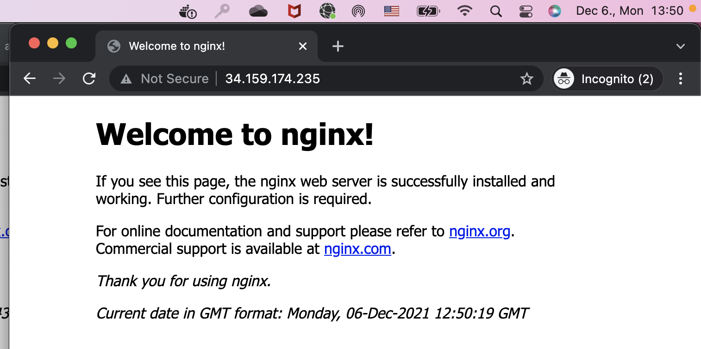

# Setup a web server using Ansible

## Task
Prerequisite: a virtual machine running Ubuntu 20.04 LTS Create an Ansible playbook that executes the following tasks:
• harden sshd by
o disablingpassword-basedauthentication
o settingthefollowingoptions:
o KexAlgorithmscurve25519-sha256@libssh.org,diffie-hellman-group- exchange-sha256 Ciphers chacha20-poly1305@openssh.com,aes256- gcm@openssh.com,aes128-gcm@openssh.com,aes256-ctr,aes192-ctr,aes128- ctr MACs hmac-sha2-512-etm@openssh.com,hmac-sha2-256- etm@openssh.com,umac-128-etm@openssh.com,hmac-sha2-512,hmac-sha2- 256,umac-128@openssh.com
• setup nginx with the default page showing the current date in GMT format


## Solution

### Prepare environment

I have used a VM instance from GCP platform with Ubuntu 20.04 LTS OS.

### Run ansible script

Add id_rsa file to the project folder.

```bash
ansible-playbook playbook-nginx.yml -i hosts
```


