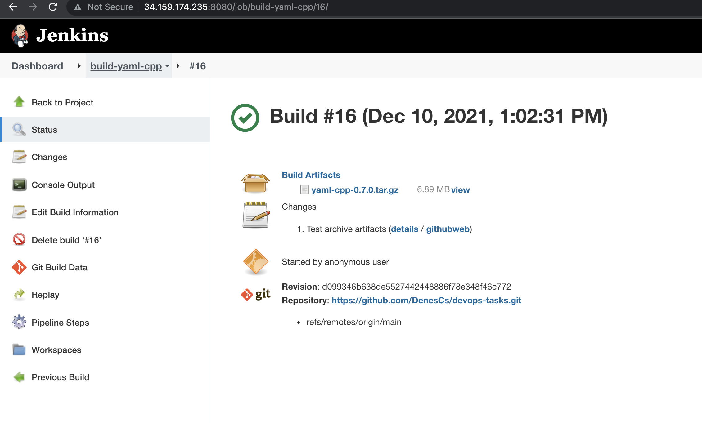

# Jenkins pipeline

## Task

Prerequisite: a virtual machine running Ubuntu 20.04 LTS with jenkins and docker installed Create a jenkins pipeline job with a scripted (not declarative) pipeline script to build the yaml-cpp project from github (https://github.com/jbeder/yaml-cpp) in docker:
• Build a docker image called yaml-cpp-builder:0.1 from Ubuntu 20.04 LTS with all the necessary dependencies for the build of yaml-cpp
• Build the yaml-cpp project inside a docker container using this image
• Be sure to limit the running container's available resources (eg. cpu, memory, ...)
• Drop all capabilities from the container
• The jenkins job shall cleanup the workspace after it has finished
Put all files you created to your repo (eg. Dockerfile, pipeline script file, any shell scripts that you might create, etc.) The pipeline script should clone everything from your repo to build yaml-cpp, eg. Dockerfile, etc.
The build process should clone yaml-cpp, compile the project, and provide a tar.gz binary artifact with the compiled results (headers, libraries, etc) in the filesystem of the docker host (ie. the tar.gz file should be available when the docker container stops at the end (use volume mount or similar). The name of the tar.gz file should include the version number, eg. yaml-cpp-0.1.2.tar.gz (hint: check out yaml-cpp.pc after running make)
Put the console log to your repo to show us the flow of the whole process.
You may use any available plugin for jenkins 2.x, if necessary. Be sure to document it in a README file.

## Solution

### Setup Jenkins

I have used the following commands to setup the Jenkins service in a GCP VM.

```bash
wget -q -O - https://pkg.jenkins.io/debian-stable/jenkins.io.key | sudo apt-key add -
sudo sh -c 'echo deb http://pkg.jenkins.io/debian-stable binary/ > /etc/apt/sources.list.d/jenkins.list'
apt update
apt install default-jre
apt install jenkins
apt install docker
usermod -aG docker jenkins
```

The following plugins have been installed via Plugin Manager: Pipeline, Git, Docker Pipeline

### Develop build pipeline

The build pipeline consists of 3 stages:

- Prepare environment: Checkouts and the preparation of the build image
- Build: Building of the yaml-cpp project
- Archive artifact: Tar the build result and archive the artifact

### Test

The job is configured and successfuly executed in the prepared Jenkins. Consol logs can be found in the console.log file.


